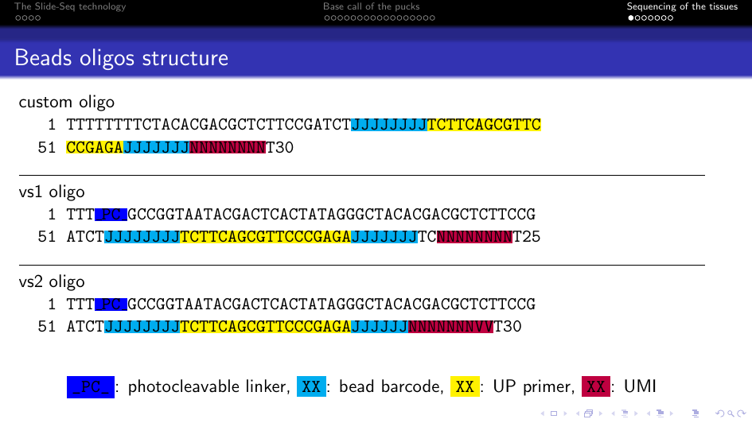

# Pipeline steps

1. [Demultiplexing](#demultiplexing)
2. [Filter out Reads 1 that are too short](#filter-out-reads-1-that-are-too-short)
3. [Extract barcode and UMI from Read 1](#extract-barcode-and-umi-from-read-1)
4. [Filter out bad UP primers](#filter-out-bad-up-primers)
5. [Extract probe sequence from Read 2](#extract-probe-sequence-from-read-2)
6. [Create probe index](#create-probe-index)
7. [Alignment](#alignment)
8. [Deduplication](#deduplication)
9. [Generate count matrix](#generate-count-matrix)

## Demultiplexing

We start with demultiplexing the BCL files in order to create FASTQ files.
We just run the [bcl2fastq program](https://support.illumina.com/sequencing/sequencing_software/bcl2fastq-conversion-software.html).

We need to tell `bcl2fastq` where to find the BCL files and the sample sheet containing the information about the samples.
This is achieved by specifying the `data_dir` and the `sample_sheet` parameters in the [parameter file](config.md).

**Warning! We don't merge the samples that were run on different lanes.**
**But I'll add that later if necessary.**

## Filter out Reads 1 that are too short

Bead barcode and UMI sequences are contained in Read 1.
Sometimes sequencing errors shorten Read 1, so this information is not available anymore.
We need to remove these shortened read because we can't process them, and this is the purpose of this step.

We use the [cutadapt program](https://cutadapt.readthedocs.io/en/stable/) in order to do that.

We need to specify and minimum length for Read 1 based on its structure (usually 41 or 43).
This is achieved with the `minimum_length_read1` parameter in the [parameter file](config.md).

## Extract barcode and UMI from Read 1

We extract the bead barcode and UMI from Read 1 based on its structure.

We use [umi_tools extract](https://umi-tools.readthedocs.io/en/latest/reference/extract.html) in order to do that.

**Currently, the read structre is hard coded and it is set to vs1.**
**We might need to allow the user to specify the read structure.**
**Again, I'll add that later if necessary.**

## Filter out bad UP primers

The bead barocode and UMI sequences are supposed to flank the UP primer sequence.
In the previous step we extracted these two sequences based on their position without taking care of the UP primer.
In this step we check the UP primer sequence in order to know that Read 1 is valid.

We just use a custom script for this step (`bin/up_primer.py`).
UP primer is supposed to be `TCTTCAGCGTTCCCGAGA`.
For each read we compute the edit distance and if this distance is above a certain threshold we filter out the read.
The threshold is usually set to 3 and can be specify in the [parameter file](config.md) by setting the `maximum_errors_up_primer` parameter.

## Extract probe sequence from Read 2

The probe sequence is contained in Read 2.
However, it is flanked with adapater sequences in both 5' and 3' and we need to remove these sequences before performing the alignment.

To do so, we use [seqtk](https://github.com/lh3/seqtk) to remove the 5' flanking region, then we use [cutadapt program](https://cutadapt.readthedocs.io/en/stable/) to shorten the read to the probe length.

This step requires two parameters in the [parameter file](config.md).
The first one is the length of the adapter in 5' (`five_prime_probe_adapter_length`, normally 38).
The second parameter is the length of the probe (`probe_length`, normally 31).

## Create probe index

Now, we need to align Read 2 in order to quantify of the abundance of the probes in the sample.
We will use [Bowtie 2](http://bowtie-bio.sourceforge.net/bowtie2/manual.shtml) for the alignment.
However, first we need to create an index made of the original probes sequences.
`Bowtie 2` need the probes sequences and a FASTA file.
The path of this FASTA file can be specified with the `probes_fasta` parameter in the [parameter file](config.md).

## Alignment

We use [Bowtie 2](http://bowtie-bio.sourceforge.net/bowtie2/manual.shtml) to align Read 2 onto the probes index previously created.

## Deduplication

The deduplication step uses the UMI to remove any sort of duplicated reads.
This step is performed using [umi_tools dedup](https://umi-tools.readthedocs.io/en/latest/reference/dedup.html).
Importantly, we run `umi_tools dedup` with the `--per-cell` parameter, which means that `umi_tools` will group the reads based on their bead barcode sequence before deduplication.
**This is something we should talk about.**

## Generate count matrix

We run [umi_tools count](https://umi-tools.readthedocs.io/en/latest/reference/count.html) in order to generate a count matrix.
We run it with the `--per-cell` and `--per-contig` parameters, which means that we count the number of probes associated with each bead barcode.

